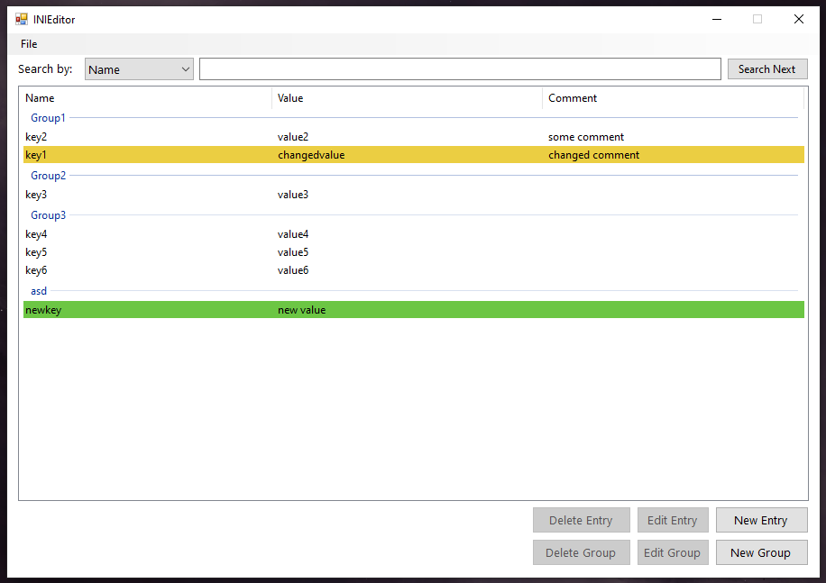

# INIEditor
 INI File editor software.
 On this early version only support INI files in the following format: 
 ```
 [GroupName1]
 KeyName1=Value1
 KeyName2=Value2
 [GroupName1]
 KeyName3=Value3
 ```
Empty lines and foward whitespaces are ignored, any comments or format differences will cause the program not to work as intended.

Future updates will include:
```
✓ Group editing and deleting
✓ Highligthing of added/edited/removed keys
✓ Search by key name
✗ Search by key value
✗ Comment support
✗ Support for creating INI files from scratch
✗ Better UI feedback (messageboxes on save, warnings on closing etc)
````

UI image:


